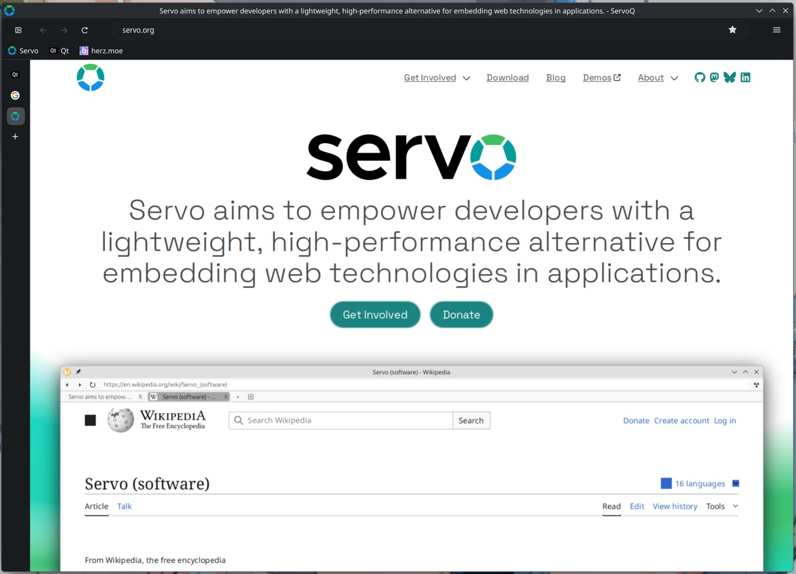

> [!CAUTION]
> 
> *This is purely a fun project that is not supposed to be proper, good or make any sense.*

> [!IMPORTANT]
> 
> In this repo i try to see how far i can come, purely with vibecoding ai-slop.
> By no means this is supposed to be a real browser, look at the repo/code at your own discretion.




# ServoQ

A Qt6 browser shell for Servo.

## Background

I've been following both [Ladybird](https://github.com/LadybirdBrowser/ladybird) and
[Servo](https://servo.org/) for a while. Ladybird recently got a clean Qt6 UI rewrite,
and separately I came across [this KDAB blog post](https://www.kdab.com/embedding-servo-in-qt/)
from early 2024, a basic proof-of-concept of embedding Servo in a Qt app using CXX-Qt.

Which raised a question: could you use Ladybird's Qt frontend as a starting point 
and wire it up to Servo instead of LibWeb? It turns out you can, with some changes to make it possible. 
That's ServoQ.

The C++ chrome under `cpp/` started as a port of Ladybird's Qt UI and several of its support libraries, 
including search engine handling, bookmark storage, history, and content blocking. Each derived file's 
header identifies which Ladybird source it was originally based on. 
The Rust side under `src/` handles Servo embedding.

ServoQ has already diverged from Ladybird's UI in several places and will likely continue to do so. 
I still intend to keep an eye on upstream Ladybird UI changes and pull in the parts that make sense for this project.

# Feature status

See [FEATURE MILESTONES](docs/FEATURE_MILESTONES.md) for implemented and WIP browser features
and [SERVO 0.4 INTEGRATION](docs/SERVO_0_4_INTEGRATION.md) for the current engine-release audit.
The latest ServoShell/Ladybird comparison is in the
[UPSTREAM REFERENCE AUDIT](docs/UPSTREAM_REFERENCE_AUDIT_2026_08.md).

## A note on how this was built

I'm a computer science student from Germany. I know my way around code, but I'm not
particularly experienced, and systems-level C++/Rust is well outside my usual territory.
This was a personal experiment: could I actually pull this off, leaning on AI tools 
for the parts I'd otherwise get stuck on? Turns out, mostly yes.

Worth being upfront about: both Ladybird and Servo are not to keen on AI-generated
contributions to their own codebases. ServoQ is an independent hobbyist project and does
not contribute back to either upstream.

## Building

**Dependencies** :

```
rust cargo base-devel gcc qt6-base qt6-svg qt6-networkauth qt6-wayland pkg-config qt6-tools clang
```

```sh
git clone https://github.com/herzblutnord/servoq
cd servoq
cargo build --release --features servo-engine
cargo run --release --features servo-engine
```

## Attribution

**[Ladybird Browser](https://github.com/LadybirdBrowser/ladybird)** - The Qt UI code and
supporting library code in `cpp/` is ported from Ladybird, developed by the Ladybird
Browser Initiative and contributors. Licensed under BSD 2-Clause. Original copyright
notices are preserved in each derived source file.

**[Servo](https://github.com/servo/servo)** - The rendering engine, used as a Rust crate
dependency. Originally created by Mozilla Research, now maintained under Linux Foundation
Europe. Licensed under MPL 2.0.

**[KDAB cxx-qt-servo-webview](https://github.com/KDABLabs/cxx-qt-servo-webview)** - The
earlier Qt/Servo experiment that started this idea.

## License

BSD 2-Clause. See [LICENSE](LICENSE). Servo is a dependency and remains under its own
MPL 2.0 license.
